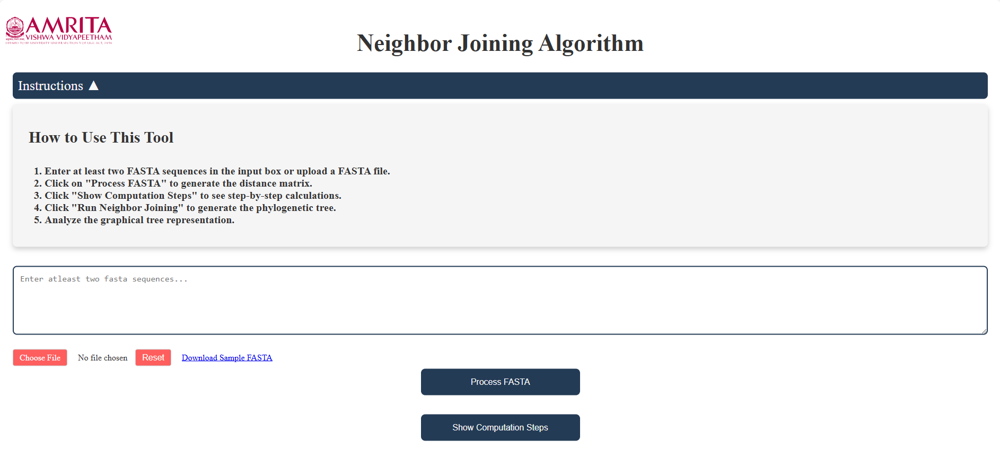
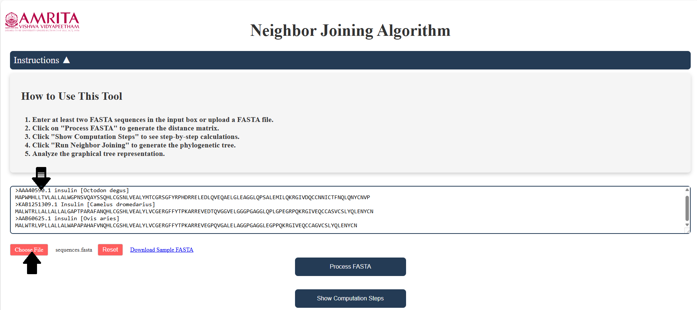
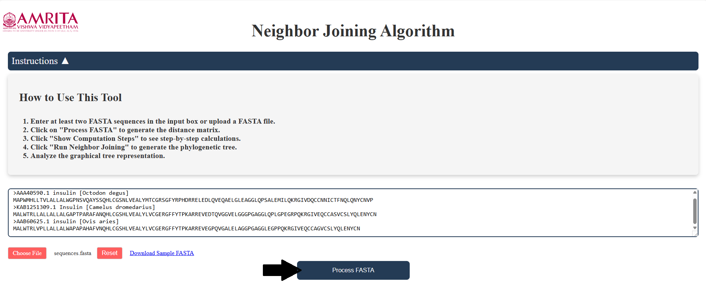
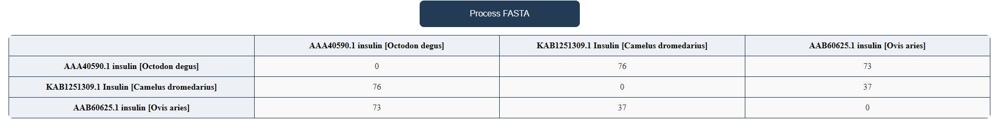
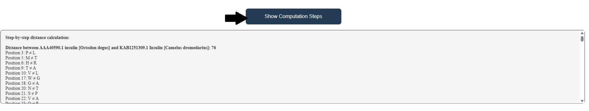
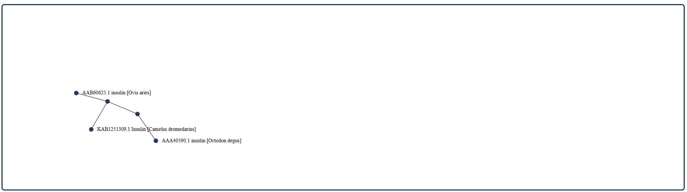
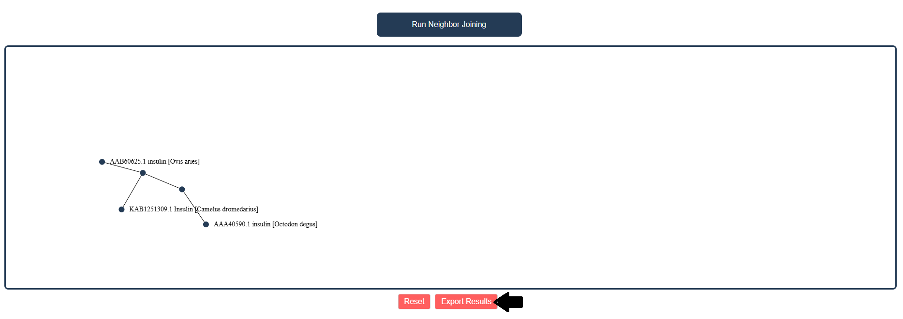
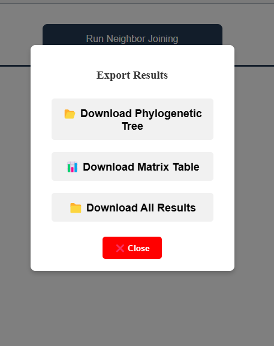

### Procedure

1. Open the simulator. Read the general instructions on how to use this tool before starting the simulation.
   
   
   
   
3. Choose a fasta file with multiple sequences or copy multiple sequences into the textbox provided.
   
  
  
3. Click on to the “Process FASTA” button
   
   

4. The initial distance matrix is calculated and displayed. Clicking on the “Show Computations” button shows the exact calculations by which the score were generated in the distance matrix
   
   
   
   
   
5. Now click on “Run Neighbor Joining” , the guide tree  is constructed with the provided query sequence
   
   
   
   
   
6. The output can be downloaded and exported by clicking on “Export Results” button
   
   
   
   
